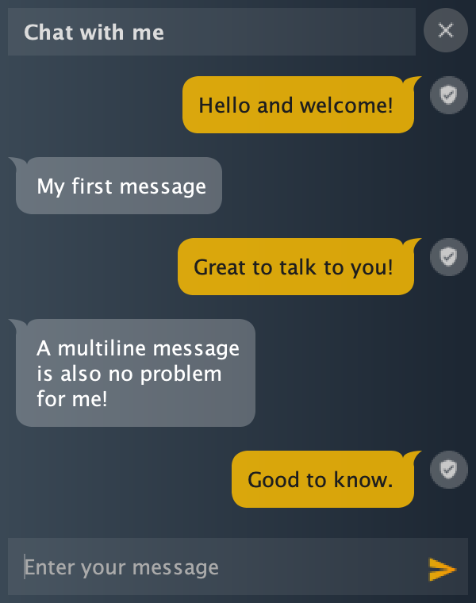

# About

A simple chat UI for swing.

# Used libs

* JVx application framework (https://sourceforge.net/projects/jvx/ - Apache 2.0)
* JIconFont (http://jiconfont.github.io/ - MIT)
* Timing framework Classic (https://github.com/akuhtz/timingframework)

# Preview

# Features

* Avatar left and right
* Typing support
* Multiline messages
* Close (optional)
* Title (optional)
* Event listener
* Customizable colors
* Translation support
